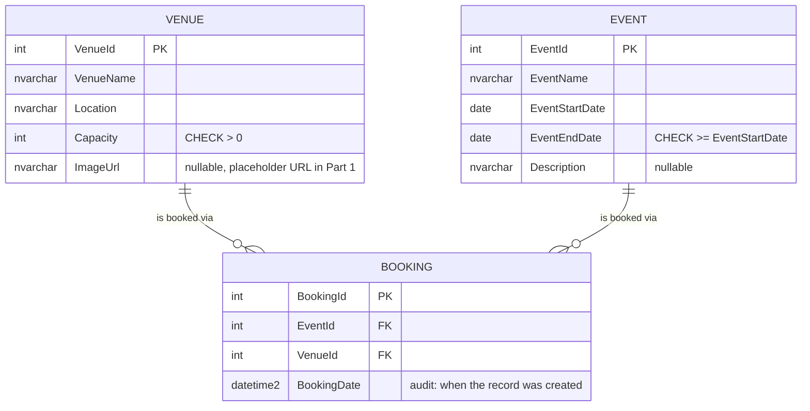
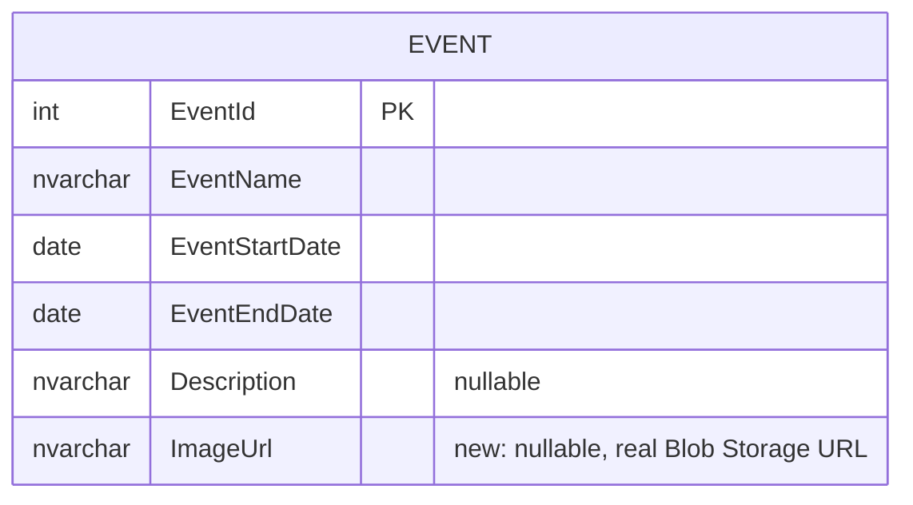
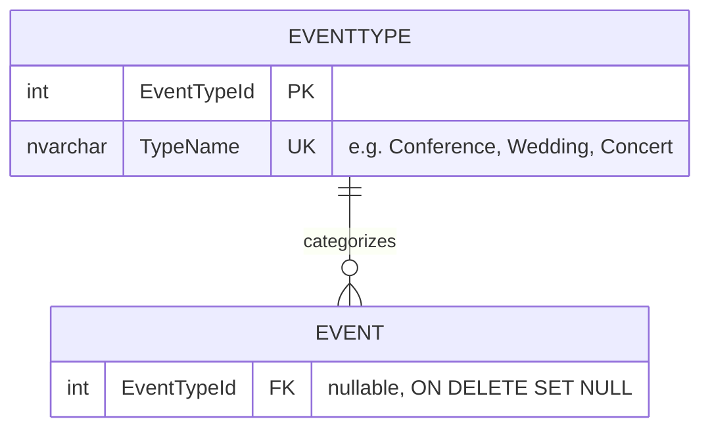
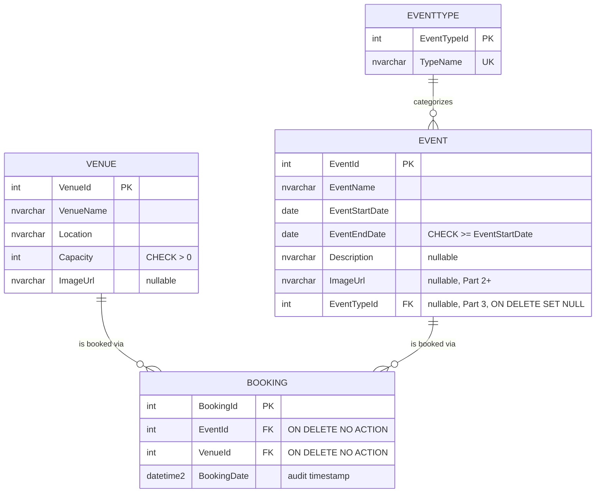

# EventEase — Entity Relationship Diagram

Shows how the schema evolves across the three POE parts, not just the final
state. See the decisions log in the POE report for the reasoning behind each
choice noted here.

## Part 1 — Foundation

**Notes**

- `Event` has no FK to `Venue`. `Booking` is the only place a venue is
  attached to an event, so an event can be loaded before a venue is
  available.
- `Event` carries a start/end date range (not a single `EventDate`) so
  multi-day events and interval-overlap double-booking checks are possible
  from Part 2 onward.
- Both FKs on `Booking` default to `ON DELETE NO ACTION` (Restrict): SQL
  Server itself refuses to delete a `Venue` or `Event` that still has a
  `Booking` row — this is the database-level half of the delete-restriction
  rule, already in place in Part 1.
- A single `Event` can, by this model, be booked at more than one `Venue`
  (e.g. a multi-venue conference) — a natural consequence of `Booking` being
  the join table, treated as an intentional design choice rather than a bug.

## Part 2 — Cloud Storage and Validation (delta only)

**Notes**

- `Event.ImageUrl` is added (`Venue.ImageUrl` already existed since Part 1)
  — additive, non-destructive migration.
- No structural change to the Venue/Event/Booking relationships.
- A double-booking trigger is added on `Booking` (see the Business Rules
  section of the POE report) — it enforces the overlap rule but adds no new
  columns or tables.
- ASP.NET Core Identity tables (`AspNetUsers`, `AspNetRoles`, etc.) are added
  via a standard EF Core Identity migration for the single Admin /
  BookingSpecialist role.

## Part 3 — Advanced Filtering (delta only)

**Notes**

- `EventType` is a lookup/reference table, not a core business entity with
  booking history, so its FK uses `ON DELETE SET NULL` rather than the
  Restrict behaviour used for Venue/Event/Booking — deleting an unused
  category shouldn't be blocked the way deleting a venue with bookings is.
- `Event.EventTypeId` is nullable; existing Part 1/2 seed events are
  backfilled to a sensible type in the Part 3 migration.

## Full schema (end of Part 3)

